*В данной лабораторной работе описание части блоков может быть пропущено или описано коротко ввиду их большого количества и изучения данных возможностей Python на более ранних курсах.  Целью данного отчёта по первому домашнему заданию является демонстрация выполнения поставленных задач, а не написание излишне длинного текста.* 
# Блокнот A
## Файл 1
В данном файле предлагается изучить базовые возможности Jupiter Notebook. При выполнении данной рабораторной работы использовался VS Code с расширением для запуска блокнотов Jupiter Notebook.   
Общий вывод данного файла - интерфейс является интуетивным. Код выполняется через нажатие клавиши "Play" у требуемого окошка, клавишей "Run All" или через сочетание клавиш Shift + Enter.  
Ниже на скриншоте приведён пример выполнения кода. Производится импорт функции **sleep** из библиотеки **time**. Происходит быстрый вывод чисел от нуля до девяти на против слов Hello World.  

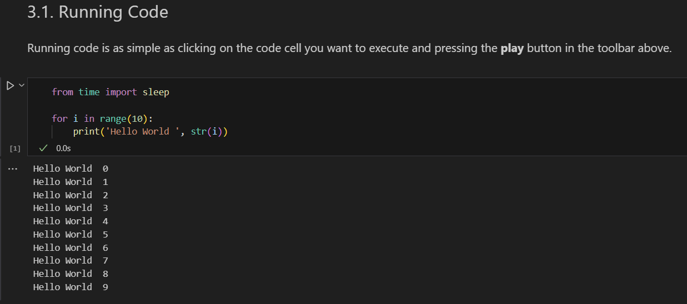

В случае, если выполнение программы требуется замедлить (*например для наблюдения за результатами в реальном времени*), может использоваться функция **sleep** импортированная на рисунке выше.  Ниже на рисунке приведен код, который выполняется примерно 20 секунд ввиду постоянного засыпания.  

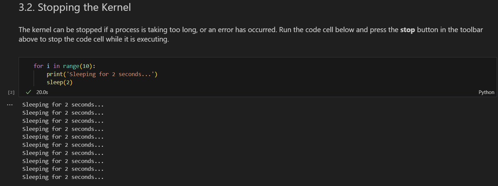

## Файл 2
Данный блокнот предлагает к изучению базовые возможности анализа данных с использованием Python.  
Для работы с массивами, распределениями и математическими функциями может быть использована библиотека **numpy**.   
Ниже на рисунке приведен пример работы библиотеки. Создение массива стандартного нормального распределения с помощью класса **random.normal**. В контексте ТКС данная возможность может быть полезна для формирования АБГШ.   
Также приведена функция, позволяющая оценить размерность массива. В данном случае создавалась матрица, что соответствует 2-м измерениям.  

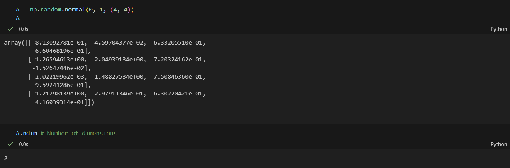

Также ниже приведены возможности оценки параметров массива: размеры, количество элементов и тип используемых данных.  

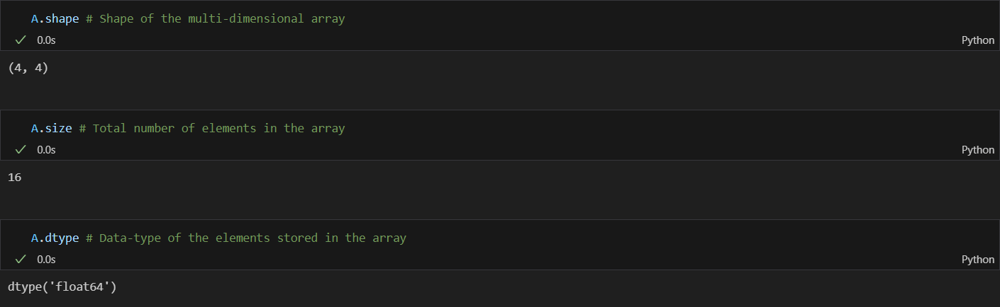

Для более удобного создания массивов приведены следующие функции:
- **zeros** - создание массива из нулей
- **ones** - создание массива из единиц
- **arange** - создание одномерного массива, заполненного числами в заданном диапазоне и с указанным шагом.
- **reshape** - изменение размерности массива
Ниже на рисунке продемонстрирована их работы  

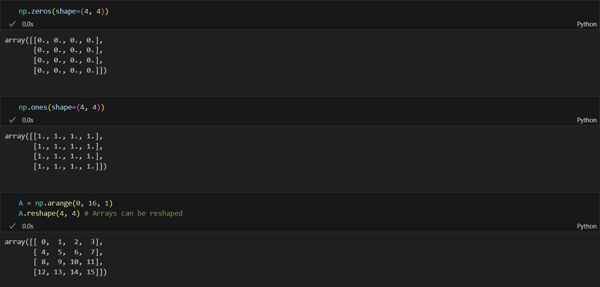

В контексте ЦОС может быть важным использование математических функций. Например здесь используется типовая конструкция, по созданию дискретного по времени сигнала. Последовательно вводятся частота дискретизации **fs**, период дискретизации **ts**, частота гармонического сигнала **fd**, число отсчётов **N**, служебный массив **n**, и непосредственно сигнал **sine_wave**.    

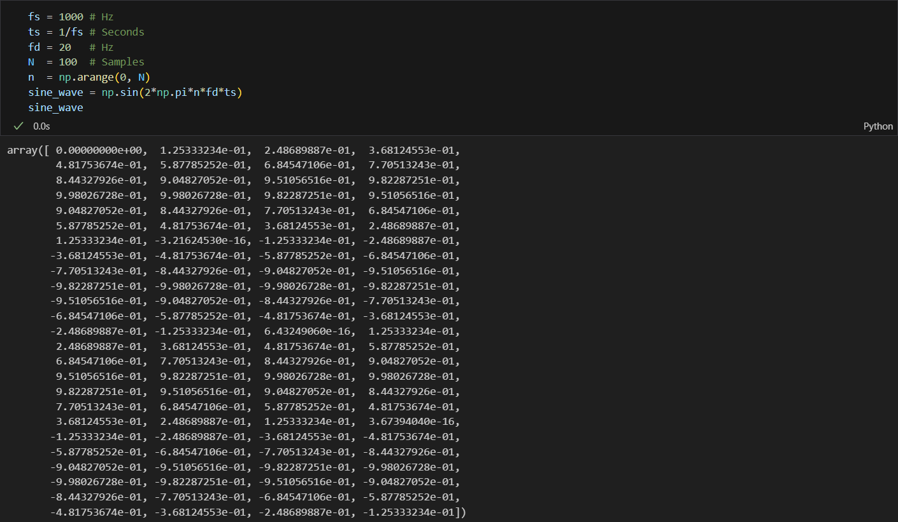

Для обработки таблиц может быть использована библиотека **pandas**. Ниже на рисунке приведён пример создания таблицы.  

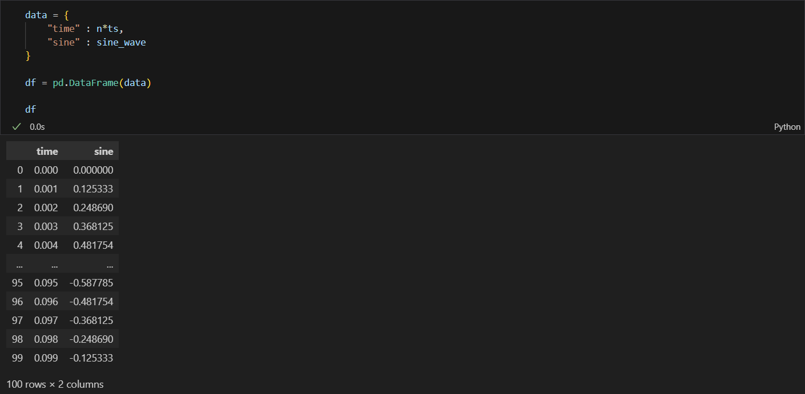

Ниже приведён пример образщения к строкам таблицы по номеру строки.  

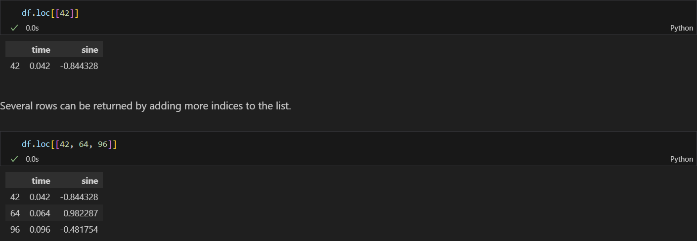

Дополнительно продемонстрирован вывод базовой информации о таблице, экспорт её в cvs-файл и последующее чтение.  

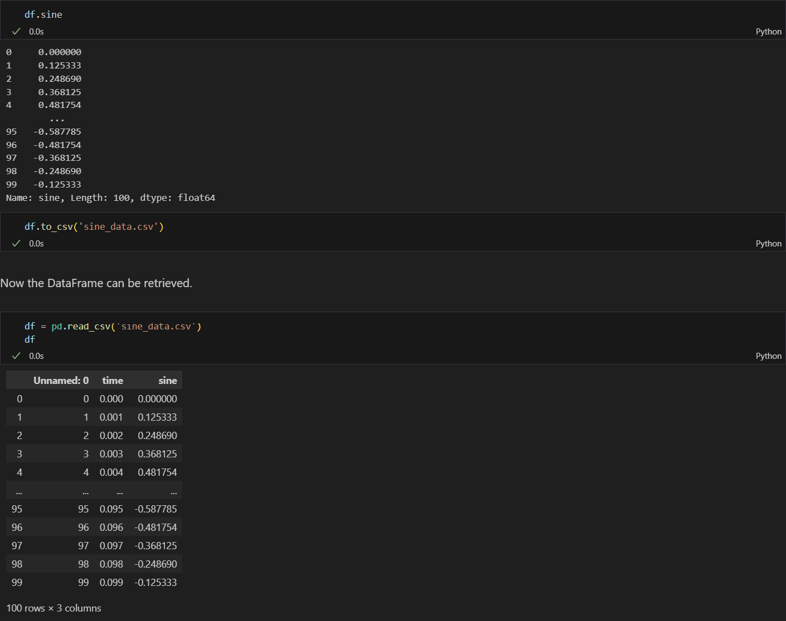

Для различных научных вычислений может применяться библиотека **SciPy**. Ниже на рисунках будут приведены примеры её использования.  
Импорт модуля **constants** и конвертация с его помощью временных интервалов в секунды.  

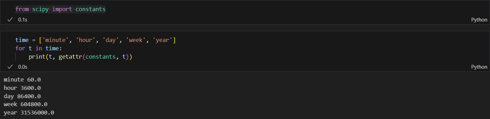 

Для поиска локального минимума функции может быть использована функция **fmin**. Ниже на картинке пример применения. Был найден локальным минимум квадратичной функции. Начальная точка поиска - 2. За 18 итераций был восстановен минимум - 0.

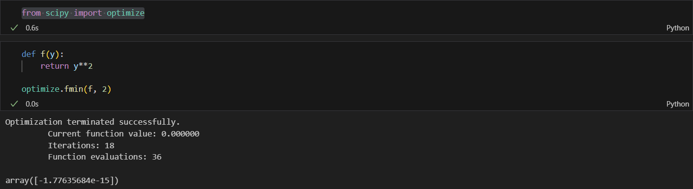   

Для возможности визуализации результатов вычисления может быть использована библиотека **matplotlib**. Ниже приведен пример вывода графика с помощью данной функции.   

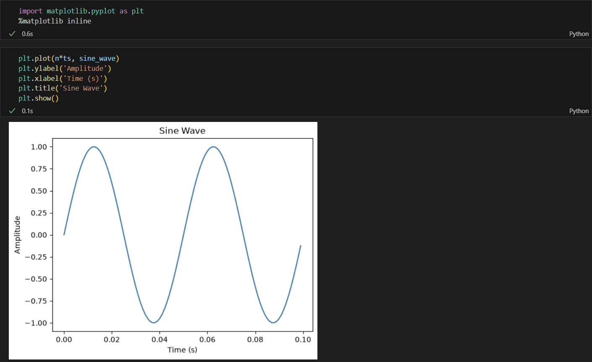   

В случае, если требуется заострить внимание, не на форме графика, а на конкретных значениях (например значениях гармоник при выводе спектра), можно использовать функцию **stem**. Ниже приведён пример вывода графика с её помощью.  

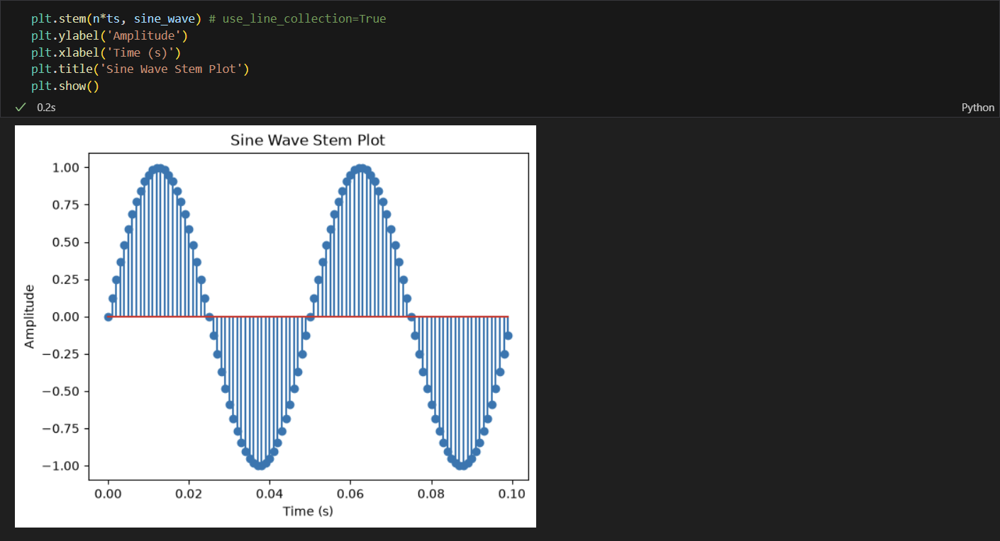   

Альтернативной библиотекой для вывода графиков является библиотека **plotly**. Ниже приведён пример её использования.  

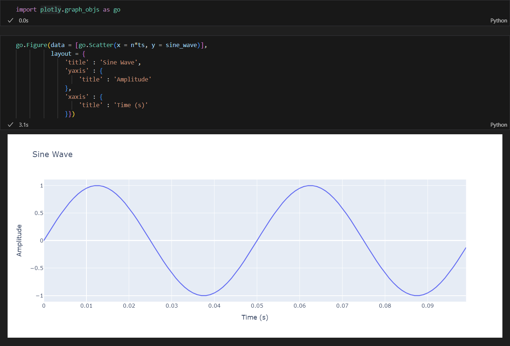   

Для возможности написания интерактивных блокнотов можно использовать библиотеку **ipywidgets**. Ниже приведён пример её использования для создания слайдера.  

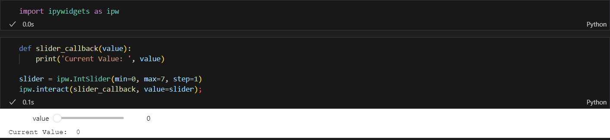   

## Файлы 3 и 4
Данные блокноты посвящены изучению фреймворка PYNQ (Python Productivity on Zynq) и работе с оверлеями на платформе RFSoC (Radio Frequency System-on-Chip). Ввиду отсутствия предоставленных плат RFSoC на момент выполнения лабораторной работы, данные блокноты выполнены быть не могут - в их описании явно указано, что ячейки кода будут успешно выполняться только на реальной платформе RFSoC, так как используют аппаратные возможности устройства Zynq UltraScale+. Тем не менее, с содержимым блокнотов было проведено ознакомление, и ниже описано, что в них происходит.

## Файл 3
В данном файле даётся введение во фреймворк PYNQ. PYNQ описывается как программный стек, состоящий из нескольких уровней: аппаратного дизайна программируемой логики (PL), операционной системы, низкоуровневых драйверов, слоя Python и слоя приложений. Основное преимущество фреймворка - предоставление предварительно настроенного программного стека с аппаратными библиотеками и переиспользуемыми компонентами.

Также в файле приведён список полезных онлайн-ресурсов: официальный сайт PYNQ, репозиторий исходного кода на GitHub, сайт RFSoC-PYNQ, документация на Read The Docs и форум поддержки.

Далее демонстрируется импорт библиотеки PYNQ и вывод списка доступных классов. Среди них выделяются:
- **Bitstream** - класс для загрузки битстрим-файлов в PL;
- **Interrupt** - класс для управления прерываниями;
- **DefaultIP** и **DefaultHierarchy** - классы для взаимодействия с аппаратными ускорителями и иерархиями IP-ядер.
Затем рассматривается концепция **оверлеев PYNQ** - конфигураций программируемой аппаратуры, расширяющих дизайн Processing System (PS) в FPGA-логику. Оверлеи позволяют использовать параллельную обработку FPGA, абстрагируя аппаратные ускорители через программные библиотеки.

В качестве примера загружается базовый оверлей:

```python
from pynq.overlays.base import BaseOverlay
base = BaseOverlay('base.bit')
```

После загрузки демонстрируется запрос статуса RF Data Converters (RFDC) через base.radio.rfdc.IPStatus.

Данный блокнот носит ознакомительный характер и подготавливает к следующему файлу, где рассматривается конкретный оверлей.

## Файл 04_overlays.ipynb

Данный блокнот углубляет понимание оверлеев PYNQ на примере дизайна **PYNQ-NCO** (Numerically Controlled Oscillator - цифровой управляемый осциллятор), разработанного командой StrathSDR.

### Импорт оверлея и инспекция дизайна

Сначала импортируется класс NumericalOverlay:

```python
from pynq_nco.overlay import NumericalOverlay
ol = NumericalOverlay()
```

При инициализации класс обнаруживает IP-ядра и иерархии в FPGA-дизайне и привязывает к ним драйверы. Содержимое дизайна можно.inspect через словарь ol.ip_dict.

Дизайн PYNQ-NCO содержит:

- **NCO IP Core** - генерирует косинусоидальные и синусоидальные сигналы в PL;
- **Data Inspector** (иерархия) - состоит из Packet Generator и AXI DMA, отвечает за передачу данных из PL в PS.

### Классы DefaultIP и DefaultHierarchy

**DefaultIP** назначается IP-ядрам без специализированного драйвера и предоставляет возможности чтения/записи регистров через AXI4-Lite интерфейс. Для NCO IP Core написан собственный класс, наследующий DefaultIP, с методами:

- ol.nco.complex_enable() - включение выхода косинуса и синуса;
- ol.nco.real_enable() - включение только косинуса;
- ol.nco.disable() - отключение выхода;
- свойства ol.nco.frequency и ol.nco.gain - установка частоты и усиления.

**DefaultHierarchy** используется для группировки IP-ядер. В данном дизайне иерархия data_inspector имеет метод ol.data_inspector.transfer(packetsize) для передачи образцов из FPGA в Processing System.

### Настройка NCO

Демонстрируется настройка параметров NCO:

```python
ol.nco.frequency = 12e6  # Гц
ol.nco.gain = 0.5        # от -1 до 1
ol.nco.complex_enable()  # косинус и синус
```

### Виджеты ipywidgets

Для интерактивного управления частотой и усилением в реальном времени используются слайдеры из библиотеки ipywidgets (изученной ранее):

```python
freq_slider = ipw.FloatSlider(min=-50e6, max=50e6, step=1e6, value=12e6)
ipw.interact(freq_callback, frequency=freq_slider)
```

Это позволяет изменять параметры NCO без перезапуска ячеек кода.

### Визуализация и анализ

Передача данных из FPGA:

```python
data = ol.data_inspector.transfer(512)
```

Данные представлены в комплексном виде: действительная часть - косинус, мнимая - синус.

**Временной график** строится через библиотеку Plotly:

```python
go.Figure(data=[go.Scatter(name="Real Data", y=data.real),
                go.Scatter(name="Imag Data", y=data.imag)], ...)
```

**Частотный спектр** получается через FFT из NumPy и отображается в логарифмической шкале:

```python
X = np.fft.fftshift(np.fft.fft(data))
X_log = 10 * np.where(X_norm > 0, np.log10(X_norm), 0)
```

На спектре должен наблюдаться пик на частоте NCO. При использовании только косинуса (real output) видны два симметричных пика (положительная и отрицательная частоты), при комплексном выходе - один пик.

# Блокнот B

Данные блокноты посвящены фундаментальным аспектам цифровой обработки сигналов: дискретизации, квантованию, работе АЦП/ЦАП и проектированию цифровых фильтров. Выполнение блокнотов не было произведено ввиду отсутствия установленного модуля rfsoc_book и плат RFSoC, однако с содержимым было проведено ознакомление.
## Файл 01

В файле рассматривается процесс дискретизации аналогового сигнала. Вводится понятие периода дискретизации $t_s$​ и частоты дискретизации $f_s = \frac{1}{t_s}$.
Демонстрируется генерация «непрерывного» синусоидального сигнала с частотой 100 Гц путём использования высокой частоты дискретизации (48000 Гц) как аппроксимации.

Далее исследуется влияние различных частот дискретизации на форму восстанавливаемого сигнала:
- при fs=100 Гц (1 отсчёт на период) сигнал интерпретируется как постоянная составляющая со смещением;
- при fs=80 Гц (менее 1 отсчёта на период) большая часть информации теряется, и сигнал воспринимается как имеющий более низкую частоту;
- при fs=800 Гц (8 отсчётов на период) форма сигнала восстанавливается удовлетворительно;
- при fs=3000 Гц избыточная частота дискретизации не даёт существенного выигрыша, но увеличивает вычислительные затраты.

Вводится теорема Котельникова (Найквиста): минимальная частота дискретизации должна быть не менее удвоенной максимальной частоты в спектре сигнала, fn≥2fmaxfn​≥2fmax​. Рассматриваются понятия базового (baseband) и полосового (bandlimited) сигналов.

Демонстрируется эффект алиасинга: при дискретизации сигнала 100 Гц с частотой 80 Гц возникает паразитная компонента на частоте $f_{alias} = \left| f - f_s \cdot \text{round}\left(\frac{f}{f_s}\right) \right| = 20$ Гц.В частотной области это проявляется как «сворачивание» спектра относительно $\frac{f_s}{2}$ (эффект Найквистовских зон).
## Файл 02
Файл посвящён процессу квантования - отображению амплитуды отсчёта на дискретный набор уровней. Для NN-разрядного АЦП количество уровней равно $2^N$, а шаг квантования определяется как $q = \frac{V_{max}}{2^{N-1}}$.
Демонстрируется квантование синусоидального сигнала с разрядностью 4 и 6 бит: увеличение разрядности уменьшает ошибку округления. Динамический диапазон N-битного преобразователя составляет $20\log_{10}(2^N) \approx 6.02N \text{ дБ}$.

Ошибка квантования моделируется как аддитивный белый гауссовский шум (АБГШ) с равномерным распределением в диапазоне $\left[-\frac{q}{2}, \frac{q}{2}\right]$. Мощность шума квантования равна $n_{ADC} = \frac{q^2}{12}$.

Рассматривается техника дитеринга: перед квантованием к сигналу добавляется гауссовский шум с нулевым средним и дисперсией $\sigma^2 = n_{ADC}$​. Это разрушает периодические составляющие ошибки квантования и подавляет паразитные спектральные компоненты, что видно при сравнении спектров квантованного сигнала с дитерингом и без него.
## Файл 03_adcs_and_dacs.ipynb

Файл рассматривает интерфейс аналог-цифра и цифра-аналог.

В части АЦП демонстрируется алиасинг на примере суммы двух синусоид (50 Гц и 240 Гц) с гауссовским шумом. При дискретизации с $f_s=200$ Гц компонента 240 Гц выходит за пределы первой зоны Найквиста и «сворачивается» в паразитную компоненту 40 Гц. Для подавления этого эффекта проектируется антиалиасинговый КИХ-фильтр нижних частот (методом Ремеца, 151 отвод) с полосой пропускания до $\frac{f_s}{2} = 100 \text{ Гц}$. После фильтрации и последующей дискретизации паразитная компонента исчезает.

В части ЦАП моделируется процесс восстановления сигнала через фильтр нулевого порядка (Zero-Order-Hold, ZOH): каждый отсчёт «удерживается» в течение периода $t_s$​, что создаёт ступенчатый сигнал. Для сглаживания ступенек применяется интерполяция (upsampling с коэффициентом $R=3$ и последующей ФНЧ-фильтрацией), а затем аналоговый фильтр восстановления с крутым спадом (400 отводов), который подавляет высокочастотные компоненты, вносимые ZOH.
## Файл 04_digital_filter_design.ipynb

Файл посвящён проектированию КИХ-фильтров (FIR). КИХ-фильтр реализует свёртку входного сигнала с импульсной характеристикой: $y(k) = \sum_{n=0}^{N-1} h_n x(k-n)$.

Рассматриваются четыре типа АЧХ: ФНЧ, ФВЧ, полосовой и режекторный фильтры. Характеристики фильтра описываются пульсациями в полосе пропускания, подавлением в полосе задерживания и шириной переходной полосы. Идеальный фильтр недостижим, поэтому приходится идти на компромиссы; качество улучшается с увеличением длины фильтра.

Анализируется фазовая характеристика: КИХ-фильтры с симметричной или антисимметричной импульсной характеристикой обеспечивают линейную ФЧХ, что важно для радиоприложений, где фаза несёт информацию.

Рассматриваются три метода проектирования:

- **Оконный метод**: идеальная импульсная характеристика (например, sinc для ФНЧ) умножается на оконную функцию (Хэмминга, Ханна, Блэкмана). Прост и быстр, но даёт ограниченное управление переходной полосой.
- **Алгоритм Паркса-Макклеллана (Ремеца)**: минимизирует максимальную ошибку между идеальной и реальной АЧХ (чебышёвская аппроксимация). Даёт более узкую переходную полосу, но может не сходиться при жёстких ограничениях.
- **Метод наименьших квадратов (firls)**: минимизирует квадрат ошибки без итераций, решая систему линейных уравнений. Гибкий и не имеет проблем со сходимостью.

# Вывод
В ходе выполнения работы были освоены базовые инструменты Python (NumPy, SciPy, Matplotlib) для моделирования сигналов, а также проведен детальный теоретический анализ фреймворка PYNQ и принципов взаимодействия с аппаратными оверлеями на платформе RFSoC. Несмотря на невозможность практического запуска блокнотов, требующих физического наличия платы, были глубоко изучены фундаментальные аспекты цифровой обработки сигналов: теорема Котельникова, эффекты алиасинга и квантования, архитектура интерфейсов АЦП/ЦАП, а также методы проектирования КИХ-фильтров. Полученные результаты формируют прочную теоретическую и алгоритмическую базу, необходимую для бесшовного перехода к практической реализации систем ЦОС на программируемой логике FPGA при предоставлении соответствующего аппаратного обеспечения.
