# Блокнот C
## Запись спектра через Gqrx
Указанная программа установлена в окружение TCS-CONDA на кафедральные ПК.
После активации были просмотрены доступные устройства. На скриншоте ниже они приведены.

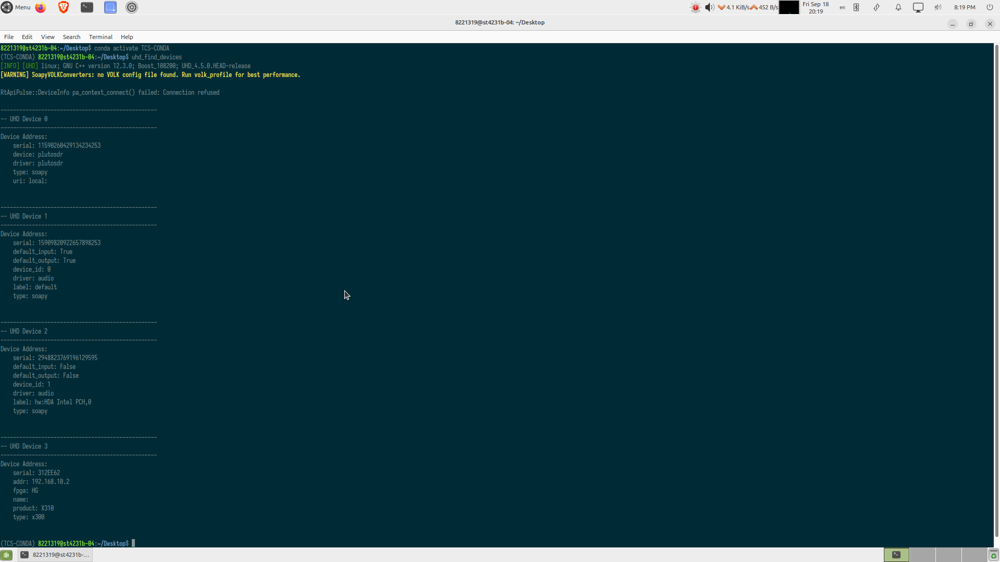  

Видно, что доступны 4 устройства.
- (ADALM-PLUTO) — подключённый SDR.
- встроенная звуковая карта
- встроенная звуковая карта на базе чипсета
- USRP X310 по сети 192.168.10.2

Предварительная настройка Gqrx выполняется в данном окне.

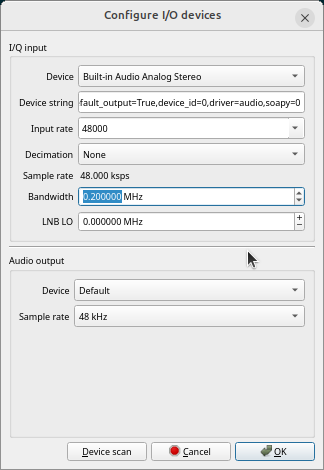  

В вечерней спешке была выбрана встроенная аудиосистема. Входная частота семплирования 48 кГц, сдвиг по частоте 0 Гц, ширина полосы входного фильтра - 0.2 МГц.

Далее программа начала принимать и обрабатывать сигнал с микрофона.

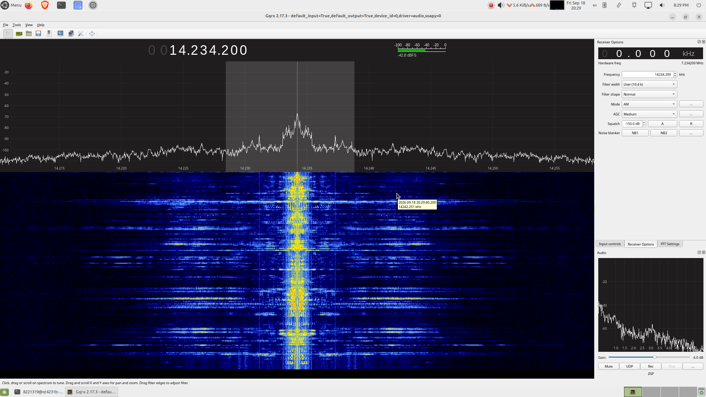  

На скриншоте виден спектр голоса. Однако в настройках программы сохранилась (или была изменена вручную) центральная частота приёма.
Программа Gqrx не знает, что сигнал был на нулевой частоте и отображает его как сигнал на высокой частоте из-за выставленных настроек.
Однако форма спектра сохранилась прежней. Видно, что примерная ширина спектра голоса получилась в районе 2.5 кГц, что может соответствовать низкому мужскому голосу.


## Файл 3
В данном файле предлагается познакомится с преобразованием Фурье. Преобразования, придуманные Иосифом Фурье позволяют разложить сигнал (в общем случае комплексный) на гармоники.   

В общем случае ряд фурье для переодической фукнции выглядит следующим образом.  

$$g(x) = a_0 + \sum_{n=1}^{\infty} a_n \cos{(nx)} + \sum_{n=1}^{\infty} b_n \sin{(nx)}.$$  

В данном случае $n$ - номер гармоники (в общем случае гармоник может быть бесконечно много). $a_0$ - постоянная составляющая сигнала (гармоника с нулевой частотой).   
В качестве примера разложения функции в ряд Фурье выполняется разложение меандра.
Для вывода меандра используется следующий код.  
```python
from scipy import signal, integrate
import matplotlib.pyplot as plt
import numpy as np

def squarewave(x, amplitude=3, dcbias=3, phase=np.pi/4):
    return signal.square(x+phase)*amplitude+dcbias
  
fs = 1e3
x = np.arange(-2*np.pi, 2*np.pi, 1/fs)
plt.plot(x, squarewave(x), label='Square Wave', linestyle='dashed')
plt.ylim([-1, 7])
plt.xlim([-2*np.pi, 2*np.pi])
plt.xlabel('Phase (Radians)')
plt.ylabel('Amplitude')
plt.show()
```
Для разложения в ряд фурье используются следующие формулы.  
$$a_0 = \frac{1}{2\pi}\int\limits_{-\pi}^\pi g(x) dx\$$  
$$a_n = \frac{1}{\pi}\int\limits_{-\pi}^\pi g(x)\cos{(nx)} dx\$$  
$$b_n = \frac{1}{\pi}\int\limits_{-\pi}^\pi g(x)\sin{(nx)} dx\$$   
Для использования данных формул приведён скрипт на **python**.  
```python
def gcos(x, g, n):
    return g(x)*np.cos(n*x)
def gsin(x, g, n):
    return g(x)*np.sin(n*x)

a0 = integrate.quad(squarewave, -np.pi, np.pi)[0]/(2*np.pi)
print('The DC bias is ' + str(a0) + '.')

g = squarewave

n = 1
a1 = integrate.quad(gcos, -np.pi, np.pi, args=(g, n))[0]/(np.pi)
b1 = integrate.quad(gsin, -np.pi, np.pi, args=(g, n))[0]/(np.pi)

s1 = a0 + a1*np.cos(n*x) + b1*np.sin(n*x)
plt.plot(x, squarewave(x), label='Square Wave', linestyle='dashed')
plt.plot(x, s1, label='1 Term')
plt.ylim([-1, 7])
plt.xlim([-2*np.pi, 2*np.pi])
plt.legend(loc='upper right')
plt.xlabel('Phase (Radians)')
plt.ylabel('Amplitude')
plt.show()

```
Результатом работы данного скрипта нахождение постоянной составляющей и первой гармоники рассматриваемого сигнала. (В данном случае параметр n = 1 регулирует номер искомой гармоники).  
Ниже на рисунке приведён результат работы данного скрипта.  

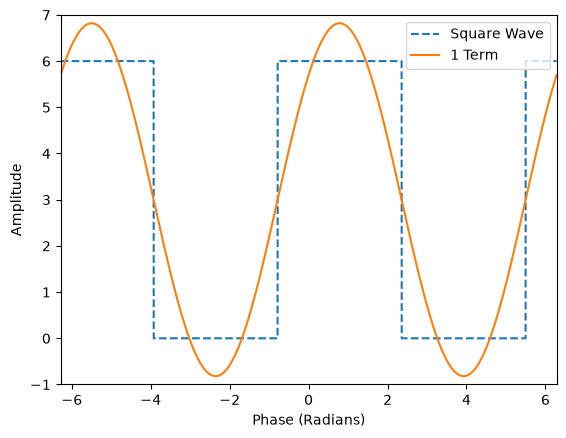  

Для большего приближения к исследуемому сигналу можно построить ряд фурье до третьей гармоники. Так как вторая гармоника равна нулю, то фактически результирующий сигнал - сумма постоянной соствляющей, первой и третьей гармоник.  
Вычислим параметры третьей гармоники.  
```python
n = 3

a3 = integrate.quad(gcos, -np.pi, np.pi, args=(g, n))[0]/np.pi
b3 = integrate.quad(gsin, -np.pi, np.pi, args=(g, n))[0]/np.pi
s3 = s1 + a3*np.cos(n*x) + b3*np.sin(n*x)

plt.plot(x, squarewave(x), label='Square Wave', linestyle='dashed')
plt.plot(x, s3, label='3 Terms')
plt.ylim([-1, 7])
plt.xlim([-2*np.pi, 2*np.pi])
plt.legend(loc='upper right')
plt.xlabel('Phase (Radians)')
plt.ylabel('Amplitude')
plt.show()
```
Результат работы скрипта приведён на рисунке ниже. Видно, что при использовании большего числа гармоник повышается соответствие начальному сигналу.  

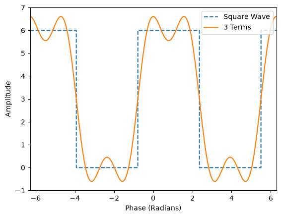  

Для разложения произвольного сигнала с произвольным периодом и подсчёта суммы ряда написаны данные функции.   
```python
def fourier_coeffs(x, g, n, a=-np.pi, b=np.pi):
    an, bn = np.zeros(n), np.zeros(n)
    a0 = integrate.quad(g, a, b)[0]/(b-a)
    for i in range(1, n + 1):
        an[i-1] = integrate.quad(gcos, a, b, args=(g, i))[0]*2/(b-a)
        bn[i-1] = integrate.quad(gsin, a, b, args=(g, i))[0]*2/(b-a)
    return a0, an, bn
    
def fourier_sum(x, a0, an, bn, n=None):
    if n == None or n > len(an):
        n = len(an)
    s = np.ones(len(x))*a0
    for i in range(1, n + 1):
        s += an[i-1]*np.cos(i*x) + bn[i-1]*np.sin(i*x)
    return s
```
Выполним разложение сигнала до 13-ой гармоники включительно.  
```python
a0, an, bn = fourier_coeffs(x, squarewave, n=26)
s = fourier_sum(x, a0, an, bn, n=13)

plt.plot(x, squarewave(x), label='Square Wave', linestyle='dashed')
plt.plot(x, s, label='13 Terms')
plt.ylim([-1, 7])
plt.xlim([-2*np.pi, 2*np.pi])
plt.legend(loc='upper right')
plt.xlabel('Phase (Radians)')
plt.ylabel('Amplitude')
plt.show()
```
Результат приведён ниже.   

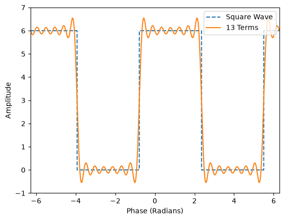  

Аналогично для 26 гармоник.  

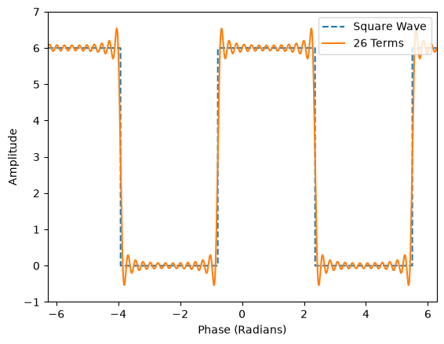  

Видно, что по мере увеличения числа гармоник точность приближения растёт.  

Выполним разложение пилообразного сигнала. Код приведён ниже.  
```python
def sawtoothwave(x, amplitude=0.5, dcbias=0.5, phase=np.pi):
    return signal.sawtooth(x+phase)*amplitude+dcbias
    
fs = 1e3
T = 1/2
ts = np.arange(0, 1, 1/fs)
x = 2*np.pi*ts/T

a0, an, bn = fourier_coeffs(x, sawtoothwave, n=5, a=x[0], b=x[-1])

s1 = fourier_sum(x, a0, an, bn, n=1)
s2 = fourier_sum(x, a0, an, bn, n=2)
s3 = fourier_sum(x, a0, an, bn, n=3)

plt.plot(ts, sawtoothwave(x), label='Sawtooth Wave', linestyle='dashed')
plt.plot(ts, s1, label='1 Term')
plt.plot(ts, s2, label='2 Terms')
plt.plot(ts, s3, label='3 Terms')

plt.ylim([-0.2, 1.2])
plt.xlim([0.0, 1.0])
plt.legend(loc='upper right')
plt.xlabel('Time (s)')
plt.ylabel('Amplitude')
plt.show()
```

Аналогично видно, что по мере повышения числа гармоник, повышается точность приближения. 

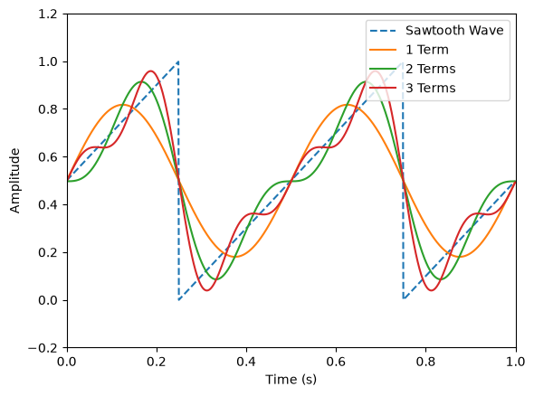  

Однако в общем случает требуется разложение комплексного сигнала. Важным для понимания данного разложения является формула Эйлера.   
$$e^{j\theta} = \cos{(\theta)} + j\sin{(\theta)}$$  
В комплексном виде ряд Фурье будет иметь следующий вид.   
$$g(t) = \sum_{n=-\infty}^{\infty} c_n e^{j2\pi nt/T}$$    
Пусть пилообразные сигнал - действительная часть комплесного сигнала, а меандр - мнимая часть. Напишем скрипт, выполняющий генерацию указанного сигнала.   
```python
def complex_wave(x, amplitude=1+0.5j, dcbias=0+0j, phase=np.pi/4+0j):
    re = signal.sawtooth(x+np.real(phase)+np.pi)*np.real(amplitude)+np.real(dcbias)
    im = signal.square(x+np.imag(phase))*np.imag(amplitude)+np.imag(dcbias)
    return re + 1j*im
    
fs = 1e3
ts = np.arange(0, 0.5, 1/fs)
T = 1/4
x = 2*np.pi*ts/T
plt.plot(ts, np.real(complex_wave(x)), label='Real Wave', linestyle='dashed')
plt.plot(ts, np.imag(complex_wave(x)), label='Imag Wave')
plt.ylim([-1.2, 1.2])
plt.xlim([0.0, 0.5])
plt.legend(loc='upper right')
plt.xlabel('Time (s)')
plt.ylabel('Amplitude')
plt.show()
```
Временная диаграмма полученного сигнала приведена ниже.

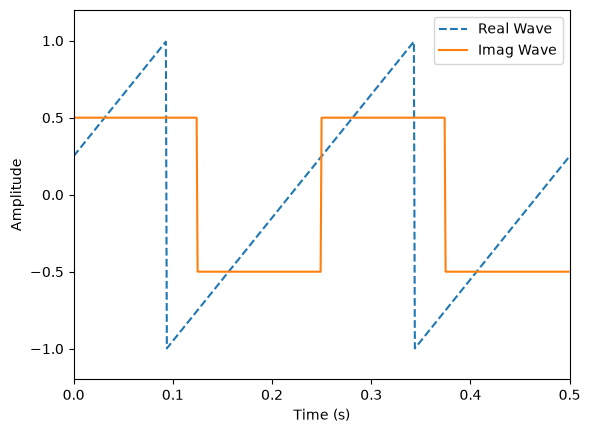  

Для разложения сигнала в ряд Фурье введём следующие вспомогательные функции.   
```python
def gexp(x, g, n):
    return g(x)*np.e**(-1j*n*x)
    
def real_gexp(x, g, n):
    return np.real(gexp(x, g, n))
  
def imag_gexp(x, g, n):
    return np.imag(gexp(x, g, n))

  def complex_fourier_coeffs(x, g, n, a=-np.pi, b=np.pi):
    an, bn = np.zeros(2*n+1), np.zeros(2*n+1)
    for i in range(-n, n+1):
        an[i+n]=integrate.quad(real_gexp, a, b, args=(g, i))[0]/(b-a)
        bn[i+n]=integrate.quad(imag_gexp, a, b, args=(g, i))[0]/(b-a)
    cn = an + 1j*bn
    return cn
  
def complex_fourier_sum(x, cn):
    n = int(np.ceil(len(cn)/2))-1
    s = np.zeros(len(x), dtype=complex)
    for i in range(-n, n+1):
        s += (cn[i+n]) * np.e**(1j*x*i)
    return s
```
Выполним разложение приведённого выше ряда Фурье с помощью данного скрипта.   
```python
n = 9
cn = complex_fourier_coeffs(x, complex_wave, n)
s = complex_fourier_sum(x, cn)
plt.plot(ts, np.real(s), label='Real Wave (9 Terms)', linestyle='dashed')
plt.plot(ts, np.imag(s), label='Imag Wave (9 Terms)')
plt.ylim([-1.2, 1.2])
plt.xlim([0.0, 0.5])
plt.legend(loc='upper right')
plt.xlabel('Time (s)')
plt.ylabel('Amplitude')
plt.show()
```
Результат работы скрипта приведён ниже. Видно сходство начального сигнала с приближением через ряд Фурье.  

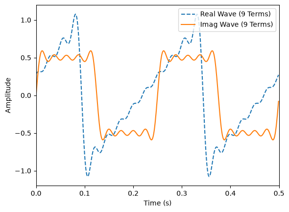  

## Файл 4
В данном файле рассматривается дискретное преобразование Фурье (ДПФ, Discrete Fourier Transform - DFT) и ключевые аспекты его практического применения: периодичность, симметрия спектра, положительные и отрицательные частоты, амплитудное и логарифмическое представление, утечка спектра (spectral leakage), оконная фильтрация (windowing), эффект фестонов (scalloping loss) и дополнение нулями (zero padding). В качестве тестового стимула формируется дискретный сигнал $x(n)$, состоящий из двух косинусоид с частотами 3 кГц и 9 кГц:   
$$a(n) = \frac{1}{2}\cos(2\pi \cdot 3000 \cdot n t_s + \pi/4)$$  
$$b(n) = \cos(2\pi \cdot 9000 \cdot n t_s)$$ $$x(n) = a(n) + b(n)$$  
где $f_s = 48\text{ кГц}$, $t_s = 1/f_s$, а число отсчетов $N = 16$. Для генерации и отображения дискретного сигнала используется следующий код:   
```python
import numpy as np
import matplotlib.pyplot as plt
fs = 48e3 # Частота дискретизации
ts = 1/fs # Период дискретизации
N = 16 # Число отсчетов
n = np.arange(N)
a = 0.5*np.cos(2*np.pi*3e3*n*ts + np.pi/4)
b = np.cos(2*np.pi*9e3*n*ts)
x = np.around(a + b, 4)

def stem_plot(x, y, title, xlabel, ylabel, xticks=None, yticks=None, figsize=(6, 3), subplot=(1, 1), bottom=None, style=None):
	fig = plt.figure(figsize=figsize)
	for idx, value in enumerate(y):
		axes = fig.add_subplot(subplot[0], subplot[1], idx+1)
			if bottom is not None:
				axes.stem(x[idx], y[idx], bottom=bottom[idx])
			else:
				axes.stem(x[idx], y[idx])
			if style is not None and style[idx] == 'dashed':
				axes.plot(x[idx], y[idx], linestyle='dashed')
			axes.grid(True, which='major')
			if xticks is not None:
				axes.set_xticks(xticks[idx])
			if yticks is not None:
				axes.set_yticks(yticks[idx])
			axes.set_title(title[idx])
			axes.set_xlabel(xlabel[idx])
			axes.set_ylabel(ylabel[idx])
			plt.box(False) stem_plot(x = [n],
									 y = [x],
							    xticks = [n],
							   figsize = (6, 3),
							     title = ["Discrete Waveform $x(n)$"],
							     style = ["dashed"],
							    xlabel = ["Samples (n)"],
							    ylabel = ["Amplitude"])
```
Временная диаграмма исходного сигнала $x(n)$ приведена ниже.  

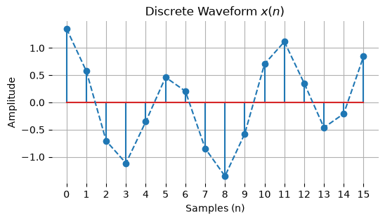  

Аналитическое выражение для вычисления прямого ДПФ имеет вид:  

$$X(k)=\sum_{n=0}^{N-1}x(n)e^{-j 2\pi kn/N}$$  

Для дискретного входного сигнала длины $N$ выходной спектральный массив $X(k)$ также будет иметь размер $N$. Напишем функцию `dft(x)` для автоматического расчета всех коэффициентов:   
```python
def dft(x):
    N = np.size(x)
    X = np.zeros(N, dtype=np.complex64)
    n = np.arange(0, N)
    for k in range(N):
        X[k] = np.sum(x*np.exp(-2j*np.pi*k*n/N))
    return X

X = np.round(dft(x), 2) + (0.0 + 0.0j) # Add 0.0+0.0j to remove -0.0-0.0j
for i in range(N):
    print(''.join(['X(',str(i),') = ',str(X[i])]))
```
В результате расчета обнаруживается свойство симметрии: $\vert{}X(1)\vert{} = \vert{}X(15)\vert{}$, $\vert{}X(3)\vert{} = \vert{}X(13)\vert{}$ и так далее.  
Амплитудный спектр $\vert{}X(k)\vert{}$ и фазовый спектр $X_{\varnothing}(k)$ находятся по формулам:  

$$\vert{}X(k)\vert{} = \sqrt{\text{Re}(X(k))^{2} + \text{Im}(X(k))^2}$$
$$X_{\varnothing}(k) = \text{atan2}\left(\text{Im}(X(k)), \text{Re}(X(k))\right)$$

Построим отдельно графики действительной и мнимой частей ДПФ, а также амплитуды и фазы.  

```python
stem_plot(x      = [n*(fs/N)/1e3, n*(fs/N)/1e3],
          y      = [np.real(X), np.imag(X)],
          yticks = [np.arange(0, 9), np.arange(-3, 4)],
          figsize= (14, 3),
          xticks = [n*(fs/N)/1e3, n*(fs/N)/1e3],
          subplot= (1, 2),
          title  = ["Real Part of $X(k)$", "Imaginary Part of $X(k)$"],
          xlabel = ["Frequency (kHz)", "Frequency (kHz)"],
          ylabel = ["Amplitude", "Amplitude"])

Xm = np.round(np.abs(X), 2)
Xp = np.round(np.angle(X, deg=True), 2)

stem_plot(x      = [n*(fs/N)/1e3, n*(fs/N)/1e3],
          y      = [Xm, Xp],
          yticks = [np.arange(0, 9), np.arange(-45, 60, 15)],
          figsize= (14, 3),
          xticks = [n*(fs/N)/1e3, n*(fs/N)/1e3],
          subplot= (1, 2),
          title  = ["Magnitude of $X(k)$", "Phase of $X(k)$"],
          xlabel = ["Frequency (kHz)", "Frequency (kHz)"],
          ylabel = ["Magnitude", "Phase (degrees)"])
```
Графики действительной и мнимой составляющих приведены ниже на рисунке.  

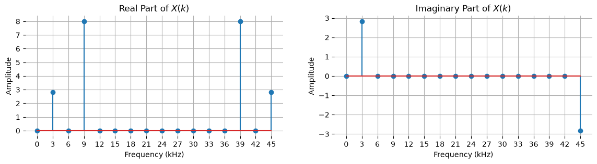
 
Графики амплитуды и фазы:  

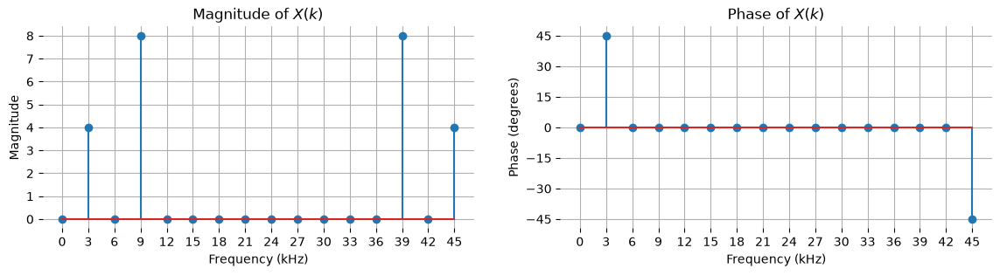

Для нормировки амплитуды полученного спектра его значения делятся на длину выборки $N$:  

$$X'(k) = \frac{1}{N}\sum_{n=0}^{N-1}x(n)e^{-j 2\pi kn/N}$$
```python
Xnorm = (Xm/N)

stem_plot(x      = [n*(fs/N)/1e3],
          y      = [Xnorm],
          figsize= (6, 3),
          yticks = [np.arange(0, 1.125, 0.125)],
          xticks = [n*(fs/N)/1e3],
          title  = ["Normalised Magnitude of $X(k)$"],
          xlabel = ["Frequency (kHz)"],
          ylabel = ["Normalised Magnitude"])
```
Результат нормировки:  

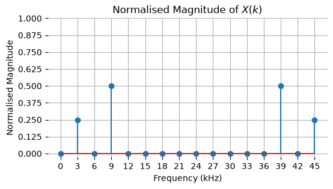  


Поскольку любой вещественный гармонический сигнал можно представить через положительные и отрицательные экспоненты (формула Эйлера):  

$$x(n) = \frac{1}{4}e^{j2\pi \cdot 3000 n t_s + \pi/4} + \frac{1}{2}e^{j2\pi \cdot 9000 n t_s} + \frac{1}{4}e^{-j2\pi \cdot 3000 n t_s + \pi/4} + \frac{1}{2}e^{-j2\pi \cdot 9000 n t_s}$$

Периодичность ДПФ описывается выражением:  

$$X(k) = X(k+N) = \sum_{n=0}^{N-1}x(n)e^{-j2\pi kn/N}$$

Построим спектр с учетом отрицательных частот, сместив спектральные составляющие:  
```python
stem_plot(x      = [(n-N/2+1)*(fs/N)/1e3],
          y      = [np.concatenate((Xnorm[N//2+1:N], Xnorm[0:N//2+1]))],
          figsize= (6, 3),
          yticks = [np.arange(0, 1.25, 0.25)],
          xticks = [(n-N/2+1)*(fs/N)/1e3],
          title  = ["Complex Frequency Spectrum of $|X\'(k)|$"],
          xlabel = ["Frequency (kHz)"],
          ylabel = ["Normalised Magnitude"])
```

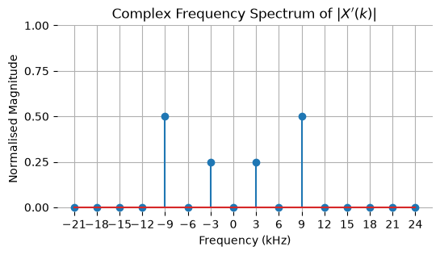  

Трехмерная визуализация суммы положительной и отрицательной комплексных экспонент:  
```python
from mpl_toolkits.mplot3d import Axes3D
  
fig = plt.figure(figsize=(14,5))
title = ['Positive-Frequency\nComplex Exponential',
         'Negative-Frequency\nComplex Exponential',
         'Sum of Complex\nExponentials (Cosine Wave)']

  

for idx, value in enumerate([positive_exp, negative_exp, real_waveform]):

    axes = fig.add_subplot(1,3,idx+1, projection='3d')
    axes.plot(np.real(value), n, np.imag(value))
    axes.set_proj_type('ortho')
    axes.set_xticks(np.arange(-1, 1.5, 0.5))
    axes.set_zticks(np.arange(-1, 1.5, 0.5))
    axes.set_yticks(np.arange(0, N+1, N/4))
    axes.set_xlabel('Re')
    axes.set_ylabel('Samples (n)')
    axes.set_zlabel('Im')
    axes.set_title(title[idx])
    axes.view_init(-150, 45)
    axes.dist = 12

fig.tight_layout()
```

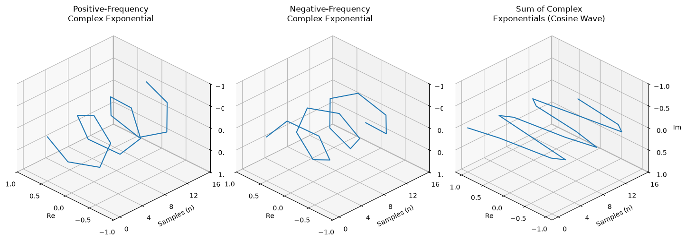  

В отличие от вещественных сигналов, чисто комплексный сигнал $x(n) = \frac{1}{4}e^{-j2\pi \cdot 12000 n t_s}$ содержит только одну спектральную линию:   
```python
fc = -12e3 # select from -21e3 to 24e3 in multiples of 3e3
cwave = np.round((1/4)*np.exp(2j*np.pi*fc*n*ts), 2)
cwave_fnorm = np.round(np.abs(dft(cwave)), 2)/N
fmag_shift = np.concatenate((cwave_fnorm[N//2+1:N], cwave_fnorm[0:N//2+1]))
 
stem_plot(x      = [(n-N/2+1)*(fs/N)/1e3],
          y      = [fmag_shift],
          figsize= (6, 3),
          yticks = [np.arange(0, 0.625, 0.125)],
          xticks = [(n-N/2+1)*(fs/N)/1e3],
          title  = ["Complex Frequency Spectrum"],
          xlabel = ["Frequency (kHz)"],
          ylabel = ["Magnitude"])
```

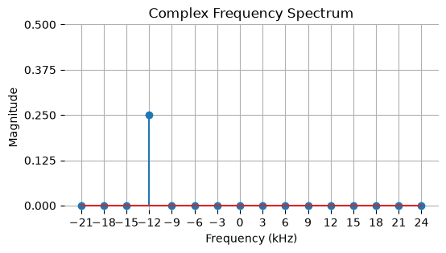  

### Представление спектра мощности и логарифмическая шкала

Спектр мощности рассчитывается как квадрат амплитудного спектра:   
$$X'_{\text{ps}}(k) = \vert{}X'(k)\vert{}^2$$

В логарифмическом масштабе (дБ и dBFS относительно полной шкалы `full-scale`):   

$$X'_{\text{dB}}(k) = 20\log_{10}(\vert{}X'(k)\vert{})$$

$$X'_{\text{dBFS}}(k) = 20\log_{10}\left(\frac{\vert{}X'(k)\vert{}}{\text{full-scale}}\right)$$

```python
fs = 1000
ts = 1/fs
fd = 200
N = 32
qlevels = 128 # -128 to 127
n = np.arange(0, N)
x = qlevels * np.sin(2*np.pi*fd*ts*n)
 
stem_plot(x      = [n],
          y      = [x],
          xticks = [n],
          yticks = [np.arange(-qlevels, qlevels+1, qlevels//2)],
          figsize= (14, 3),
          title  = ["Quantised Discrete Waveform $x(n)$"],
          style  = ["dashed"],
          xlabel = ["Samples (n)"],
          ylabel = ["Amplitude"])

X = np.round(dft(x), 2) + (0.0 + 0.0j) # Add 0.0+0.0j to remove -0.0-0.0j
Xm = np.round(np.abs(X), 2)
Xnorm = (Xm/N)*2 # multiply by 2 as real
Xpow = Xnorm**2  # power calculation
Xlogpow = 20*np.where(Xnorm>0, np.log10(Xnorm), 0) # log scale
  
stem_plot(x      = [n[0:N//2+1:1]*(fs/N), n[0:N//2+1:1]*(fs/N)],
          y      = [Xpow[0:N//2+1:1], Xlogpow[0:N//2+1:1]],
          subplot= (1, 2),
          figsize= (14, 3),
          bottom = [0, 15],
          style  = ["dashed", "dashed"],
          yticks = [np.arange(0, 10000+1, 2000), np.arange(15, 40+1, 5)],
          xticks = [n[0:N//2+1:2]*fs/N, n[0:N//2+1:2]*fs/N],
          title  = ["Power Spectra of $X(k)$", "Log-Scale Power Spectra of $X(k)$"],
          xlabel = ["Frequency (Hz)", "Frequency (Hz)"],
          ylabel = ["Power", "Power (dB)"])
         Xdbfs = 20*np.where(Xpow>0, np.log10(Xnorm/qlevels), 0)

  
stem_plot(x      = [n[0:N//2+1:1]*(fs/N)],
          y      = [Xdbfs[0:N//2+1:1]],
          figsize= (6, 3),
          bottom = [-25],
          yticks = [np.arange(0, -25-1, -5)],
          style  = ["dashed"],
          xticks = [n[0:N//2+1:2]*fs/N],
          title  = ["dBFS Log-Scale Power Spectra of $X(k)$"],
          xlabel = ["Frequency (Hz)"],
          ylabel = ["Power (dBFS)"])
        
```
Временная диаграмма гармонического сигнала:  

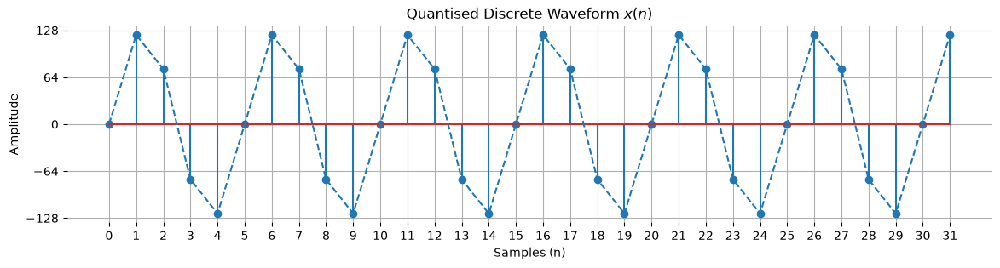

Спектры мощности и логарифмическая шкала:  

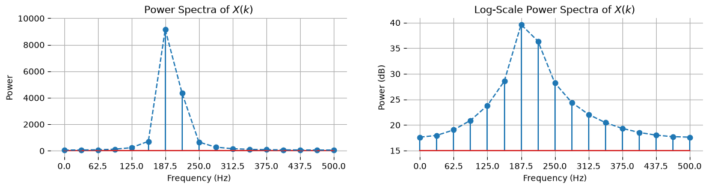

### Частотное разрешение и спектральная утечка (Spectral Leakage)

Частотное разрешение $\Delta f$ определяется соотношением:  

$$\Delta f = \frac{f_s}{N}$$  

Если частота входного сигнала не кратна шагу сетки ДПФ $\Delta f$, на границах интервала выборки возникает разрыв непрерывности, приводящий к спектральной утечке (энергия гармоники "растекается" по соседним бинам). Для демонстрации зададим сигнал с частотой 80 Гц при $f_s = 1000\text{ Гц}$ и $N = 16$ (разрешение $\Delta f = 62.5\text{ Гц}$):  
```python
fs = 1000
ts = 1/fs
fd = 80
N = 16
n = np.arange(0, N)
x = np.sin(2*np.pi*fd*ts*n)
X = dft(x)
Xm = np.round(np.abs(X), 2)
Xnorm = (Xm/N)*2

Nc = 1024
Xc = dft(np.pad(x, (0, Nc-N), 'constant'))
Xcm = np.round(np.abs(Xc), 2)
Xcnorm = (Xcm/N)*2

fig = plt.figure(figsize=(6, 3))
axes = fig.add_subplot(1, 1, 1)
axes.stem(n[0:N//2+1:1]*(fs/N), Xnorm[0:N//2+1:1])
axes.plot(np.arange(0, Nc//2+1, 1)*(fs/Nc), Xcnorm[0:Nc//2+1:1], linestyle='dashed')
axes.grid(True, which='major')
axes.set_title('Normalised Magnitude of $X(k)$')
axes.set_yticks(np.arange(0, 1.2, 0.2))
axes.set_xticks(n[0:N//2+1:1]*fs/N)
axes.set_xlabel('Frequency (Hz)')
axes.set_ylabel('Normalised Magnitude')
plt.box(False)
```
На графике наглядно видно растекание энергии центрального лепестка. Несмотря на то, что в оригинальном сигнале одна частота, на финальном графике получился ряд частот:  

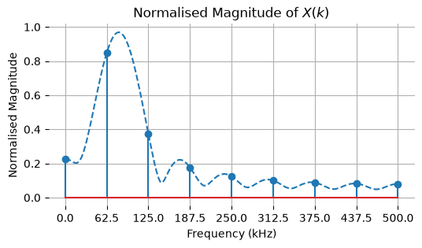  

### Оконная фильтрация (Windowing)

Для подавления боковых лепестков сигнал перед вычислением ДПФ умножается на весовую функцию (окно) $w(n)$:  

$$X_w(k)=\sum_{n=0}^{N-1}w(n) \cdot x(n)e^{-j2\pi kn/N}$$  

Сравним прямоугольное окно и окно Ханна (Hanning), нормализуя спектр на сумму коэффициентов окна $\sum_n w(n)$:  
```python
w = np.hanning(N)
xw = x * w

Xm = np.round(np.abs(dft(x)), 2)*2
Xwm = np.round(np.abs(dft(xw)), 2)*2

Xnorm = Xm/np.sum(np.ones(N))
Xwnorm = Xwm/np.sum(np.hanning(N))

stem_plot(x      = [n[0:N//2+1:1]*(fs/N), n[0:N//2+1:1]*(fs/N)],
          y      = [Xnorm[0:N//2+1:1], Xwnorm[0:N//2+1:1]],
          yticks = [np.arange(0, 1.25, 0.25), np.arange(0, 1.25, 0.25)],
          figsize= (14, 3),
          style  = ["dashed", "dashed"],
          xticks = [n[0:N//2+1:1]*fs/N, n[0:N//2+1:1]*fs/N], 
          subplot= (1, 2),
          title  = ["Normalised Magnitude Spectra (Rectangular Window)",
                    "Normalised Magnitude Spectra (Hanning Window)"],
          xlabel = ["Frequency (Hz)", "Frequency (Hz)"], 
          ylabel = ["Normalised Magnitude", "Normalised Magnitude"])
```
Сравнение спектров с окном и без него:  

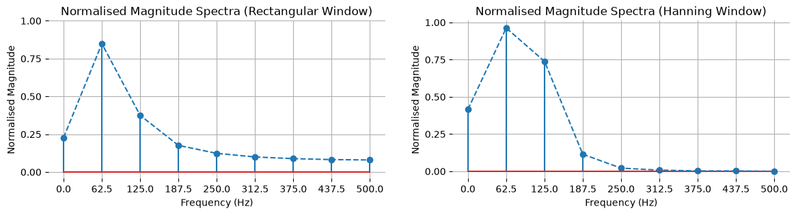  

Эффект фестонов (Scalloping Loss, SL) описывает снижение уровня амплитуды, когда частота сигнала попадает ровно посередине между двумя бинами:  

$$\text{SL} = \frac{\vert{}\sum_{n}w(n)e^{-j\pi n/N}\vert{}}{\sum_{n}w(n)}$$  

```python
def scallop_loss(w):
    N = len(w)
    n = np.arange(0, N, 1)
    numerator = np.abs(np.sum(w*np.exp(-1j*np.pi*n/N)))
    decimator = np.sum(w)
    return numerator/decimator

print("SL Rectangular:", np.round(scallop_loss(np.ones(16)), 4))
print("SL Hanning:", np.round(scallop_loss(np.hanning(16)), 4))
```
В данном случае выводом кода являются 2 числа: 0.6376 и 0.8661. Это означает, что без использования окна (или с прямоугольным окном) остаётся примерно 64% от начальной амплитуды гармоники. Использования окна Ханна повышает эту величину до 85%.
### Дополнение нулями (Zero Padding)

Дополнение исходного сигнала нулями не добавляет новой информации, однако увеличивает плотность отсчетов спектральной сетки за счет интерполяции огибающей ДПФ.  

Оригинальный сигнал (скрипт):  
```python
fs = 2000
ts = 1/fs
fd = 250
N = 16
n = np.arange(0, N, 1)
x = np.sin(2*np.pi*fd*ts*n)
Xm = np.round(np.abs(dft(x)), 2)*2
  
stem_plot(x      = [n, n[0:N//2+1:1]*(fs/N)],
          y      = [x, Xm[0:N//2+1]],
          subplot= (2, 1),
          figsize= (14, 10),
          style  = ["dashed", "dashed"],
          yticks = [np.arange(-1, 1+0.5, 0.5), np.arange(0, 20, 4)],
          xticks = [n, n[0:N//2+1:1]*fs/N],
          title  = ["Discrete Waveform $x(n)$", "Magnitude Spectra of $x(n)$"],
          xlabel = ["Samples (n)", "Frequency (Hz)"],
          ylabel = ["Amplitude", "Magnitude"])
```
Добавление 16 нулей (увеличение длительности сигнала в 2 раза):

```python
fs = 2000
ts = 1/fs
fd = 250
N = 16
n = np.arange(0, N, 1)
x = np.sin(2*np.pi*fd*ts*n)

Nc = 32
n_pad = np.arange(0, Nc, 1)
xp = np.pad(x, (0, Nc-N), 'constant')
Xm = np.round(np.abs(dft(xp)), 2)*2

stem_plot(x      = [n_pad, n_pad[0:Nc//2+1:1]*(fs/Nc)],
          y      = [xp, Xm[0:Nc//2+1]],
          subplot= (2, 1),
          figsize= (14, 8),
          style  = ["dashed", "dashed"],
          yticks = [np.arange(-1, 1+0.5, 0.5), np.arange(0, 20, 4)],
          xticks = [n_pad, n_pad[0:Nc//2+1:1]*fs/Nc],
          title  = ["Discrete Waveform $x(n)$", "Magnitude Spectra of $x(n)$"],
          xlabel = ["Samples (n)", "Frequency (Hz)"], 
          ylabel = ["Amplitude", "Magnitude"])
```
Добавление ещё 32 нулей (скрипт).  
```python
Nc = 48
n = np.arange(0, Nc, 1)
xp = np.pad(x, (0, Nc-N), 'constant')
Xm = np.round(np.abs(dft(xp)), 2)*2

stem_plot(x      = [n, n[0:Nc//2+1:1]*(fs/Nc)],
          y      = [xp, Xm[0:Nc//2+1]],
          subplot= (2, 1),
          figsize= (14, 10),
          style  = ["dashed", "dashed"],
          yticks = [np.arange(-1, 1+0.5, 0.5), np.arange(0, 20, 4)],
          xticks = [n, n[0:Nc//2+1:1]*fs/Nc],
          title  = ["Discrete Waveform $x(n)$", "Magnitude Spectra of $x(n)$"],
          xlabel = ["Samples (n)", "Frequency (Hz)"], 
```
Оргинальный спектр:  
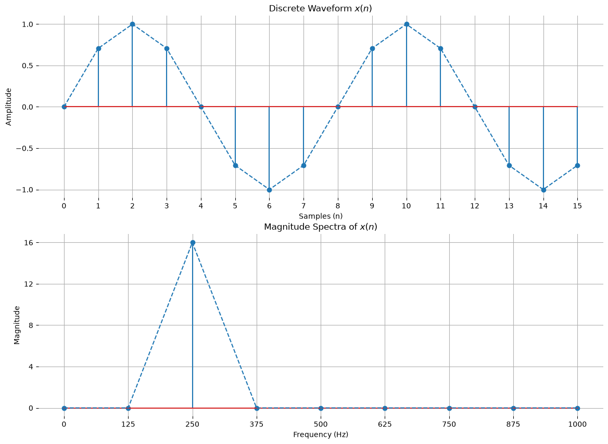

Результат дозаполнения выборки нулями (16 нулей):  

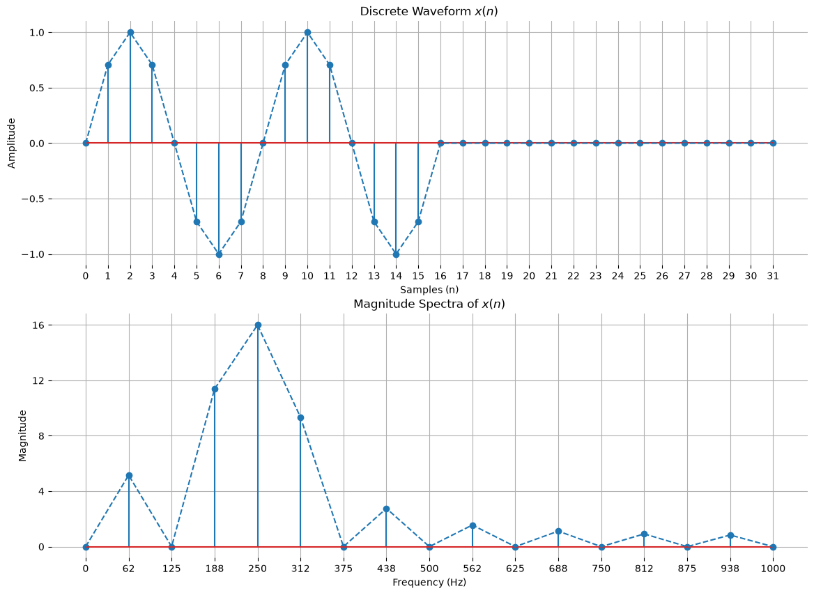
Результат дозаполнения выборки нулями (48 нулей):  

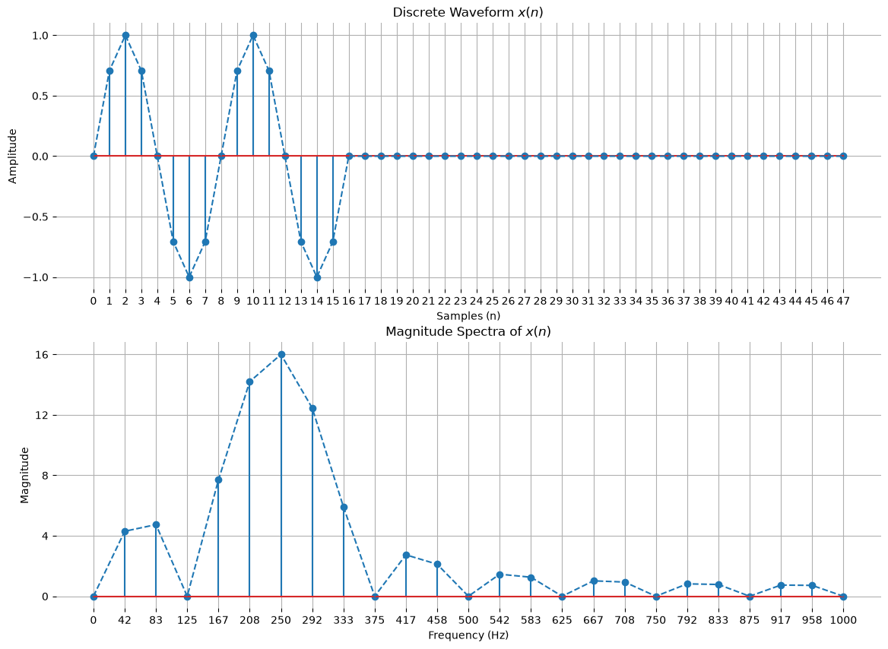  

## Файл 5

В данном файле рассматриваются принципы быстрого преобразования Фурье (БПФ, Fast Fourier Transform - FFT) и спектрограммы на базе оконного преобразования Фурье (Short-Time Fourier Transform - STFT). БПФ представляет собой оптимизированный алгоритм вычисления ДПФ, сокращающий сложность с $O(N^2)$ до $O(N \log_2 N)$.

### Лемма Дэниелсона - Ланцоша и прореживание по времени (Decimation-in-Time)

В основе алгоритма Кули - Тьюки лежит деление исходной последовательности отсчетов длины $N$ (где $N$ - степень двойки) на четные и нечетные отсчеты:

$$X(k) = \sum_{n=0}^{N/2-1}x(2n)e^{-j2\pi (2n)k/N} + \sum_{n=0}^{N/2-1}x(2n+1)e^{-j2\pi (2n+1)k/N}$$  

Вынося общий фазовый множитель (twiddle factor) $W_N^k = e^{-j2\pi k/N}$:

$$X(k) = X^{\text{even}}(k) + W_N^k X^{\text{odd}}(k)$$  

Поворотный множитель обладает свойством симметрии:

$$W_N^k = -W_N^{k+N/2}$$  

Реализация алгоритма БПФ на основе рекурсивного разделения по четным и нечетным индексам:

```python
import numpy as np
import matplotlib.pyplot as plt

def fft(x):
    N = np.size(x)
    if N == 1:
        return x
    else:
        Xeven = fft(x[0::2])
        Xodd = fft(x[1::2])
        k = np.arange(N)
        X = np.zeros(N, dtype=np.complex64)
        Wk = np.exp(-2j*np.pi*k[0:N//2]/N)
        temp = Wk * Xodd
        X[0:N//2] = Xeven + temp
        X[N//2:N] = Xeven - temp
        return X

# Тестовый сигнал 
fs = 48e3
ts = 1/fs
N = 8
n = np.arange(N)
a = 0.5*np.cos(2*np.pi*6e3*n*ts + np.pi/4)
b = np.cos(2*np.pi*12e3*n*ts)
x = np.around(a + b, 4)

X = fft(x)
Xnorm = np.abs(X)/N

stem_plot(x      = [n[0:N//2+1]*fs/N/1e3],
          y      = [Xnorm[0:N//2+1]],
          xticks = [n[0:N//2+1]*fs/N/1e3],
          figsize= (6, 3),
          title  = ["Normalised Magnitude Spectra of $X(k)$"], 
          xlabel = ["Frequency (kHz)"], 
          ylabel = ["Amplitude"]) 
          ylabel = ["Amplitude", "Magnitude"])
```

График амплитудного спектра, полученного через собственную функцию fft:

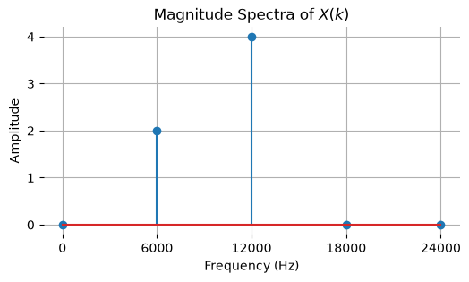  

Сравнение времени работы наивного ДПФ и алгоритма БПФ при длине массива $N = 2048$:  
```python
N = 2048
n = np.arange(N)
x = np.around(0.5*np.cos(2*np.pi*6e3*n*ts + np.pi/4) + np.cos(2*np.pi*12e3*n*ts), 4)

# Время работы DFT
%time Xdft = dft(x)

# Время работы FFT
%time Xfft = fft(x)

# Проверка эквивалентности результатов
print(np.all(np.round(Xfft, 2) == np.round(Xdft, 2)))
```
Вывод кода:
*CPU times: total: 188 ms
Wall time: 193 ms*

*CPU times: total: 15.6 ms
Wall time: 17.5 ms*

Для промышленных вычислений используется встроенный модуль numpy.fft.fft:
```python
X = np.fft.fft(x)
Xnorm = np.abs(X)/N
```
Оконное преобразование Фурье (STFT) и спектрограммы (Waterfall Plot)
Когда частотный состав сигнала меняется во времени, применяется оконное преобразование Фурье (STFT). Сигнал разбивается на блоки (фреймы), каждый из которых взвешивается окном и обрабатывается через БПФ.

В качестве первого примера исследуется сумма трех стационарных гармоник (60 Гц, 120 Гц и 250 Гц):

```python
fs = 1024
f1, f2, f3 = 60, 120, 250
N = 512
L = N * 256

sine_1 = np.sin(2*np.pi*f1*np.arange(L)/fs)
sine_2 = 0.5*np.sin(2*np.pi*f2*np.arange(L)/fs)
sine_3 = 0.7*np.sin(2*np.pi*f3*np.arange(L)/fs)
sum_of_tones = (sine_1 + sine_2 + sine_3).reshape(-1, N)

# Вычисление спектральной плотности мощности (PSD) во времени
X = np.fft.fft(sum_of_tones * np.hamming(N), N)[:, :int(N/2)]
Xlog = 10*np.log10(2*np.abs(X)**2/N)
freqs = np.fft.fftfreq(N, 1/fs)[:int(N/2)]

fig = plt.figure(figsize=(10, 5))
ax = plt.axes()
im = plt.pcolormesh(freqs, np.arange(int(L/N))/fs, Xlog, vmin=-50, shading='gouraud')
ax.set_xlabel('Frequency, Hz')
ax.set_ylabel('Time, s')
ax.set_title('Waterfall Plot (Sum of Tones)')
fig.colorbar(im)
plt.show()
```
Спектрограмма стационарного многотонального сигнала:

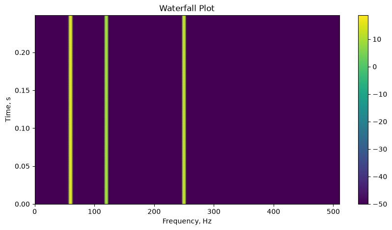  

В качестве второго примера сгенерирован ЛЧМ-сигнал (чирп), частота которого линейно возрастает во времени:  
```python
fs = 1024
N = 512
L = N * 256

# Линейное нарастание частоты
f = 0.0019 * np.arange(L)
chirp = np.sin(2*np.pi*f*np.arange(L)/fs)

# Временная форма чирпа
stem_plot(x      = [np.arange(0, 4096, 10)],
          y      = [chirp[:4096:10]],
          xticks = [np.arange(0, 4096, 1000)],
          figsize= (14, 3),
          title  = ["Chirp Signal"], 
          xlabel = ["Samples (n)"], 
          ylabel = ["Amplitude"])

# Спектрограмма чирпа
chirp_frames = chirp.reshape(-1, N)
X = np.fft.fft(chirp_frames * np.hamming(N), N)[:, :int(N/2)]
Xlog = 10*np.log10(2*np.abs(X)**2/N/fs)
freqs = np.fft.fftfreq(N, 1/fs)[:int(N/2)]

fig = plt.figure(figsize=(10, 5))
ax = plt.axes()
im = plt.pcolormesh(freqs, np.arange(int(L/N))/fs, Xlog, vmin=-50, shading='gouraud')
ax.set_xlabel('Frequency, Hz')
ax.set_ylabel('Time, s')
ax.set_title('Waterfall Plot (Chirp)')
fig.colorbar(im)
plt.show()
```

Временной график ЛЧМ-сигнала:  

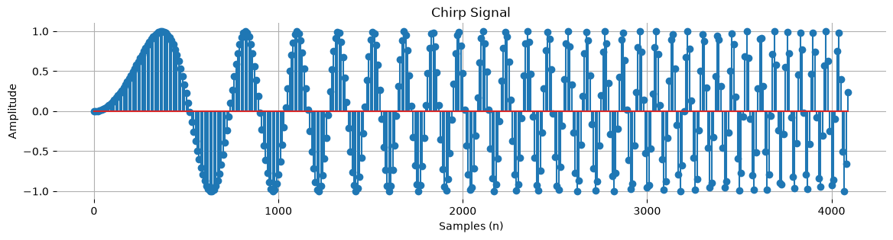  

Спектрограмма (Waterfall Plot) с нарастающей частотой:  

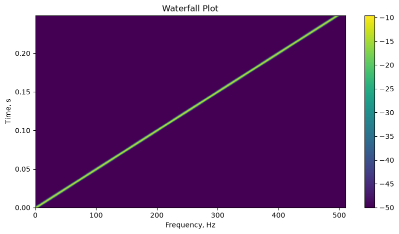  

## Вывод к файлам 3, 4 и 5

В ходе изучения данных материалов был рассмотрен переход от классического гармонического анализа непрерывных сигналов к алгоритмам цифровой обработки во временной и частотной областях:

1. **Ряд Фурье (Файл 3):** показано, что любой периодический сигнал (как вещественный вроде меандра и пилы, так и комплексный) можно представить в виде суммы гармонических составляющих. Наглядно продемонстрировано, что увеличение числа учитываемых гармоник повышает точность аппроксимации исходного сигнала, а также проявляется эффект Гиббса на разрывах функции.
2. **Дискретное преобразование Фурье (Файл 4):** рассмотрен переход к дискретным последовательностям конечной длины. Исследованы свойства симметрии и периодичности спектра, представление вещественных и комплексных частотных составляющих, а также логарифмическая шкала мощности. Изучена проблема спектральной утечки при некратности частоты сигнала шагу сетки ДПФ и методы борьбы с ней с помощью оконного взвешивания (окон Ханна) и дополнения нулями (zero padding).
3. **Быстрое преобразование Фурье и STFT (Файл 5):** разобран алгоритм БПФ Кули - Тьюки с прореживанием по времени на базе леммы Дэниелсона - Ланцоша, позволяющий сократить вычислительную сложность с $O(N^2)$ до $O(N \log_2 N)$ и на порядки ускорить анализ спектра без потери точности. На примере стационарных тонов и ЛЧМ-сигнала показана работа кратковременного (оконного) преобразования Фурье (STFT) и построение спектрограмм (waterfall plot) для отслеживания динамики частот во времени.